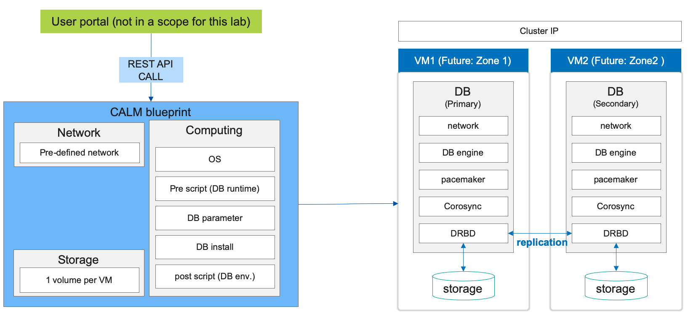
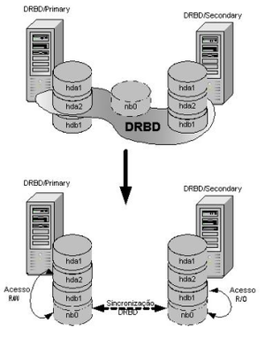

.. title:: LAB: DRBD MySQL

.. _DRBD MySQL:

----------------------------
LAB: DRBD MySQL
----------------------------

In this lab, we will use Calm blueprint to deploy 2 VMs and configure MYSQL/DRBD/Virtual IP. 

DRBD
+++++

DRBD is a distributed replicated storage system for the Linux platform. It is implemented as a kernel driver, several userspace management applications, and some shell scripts. DRBD is traditionally used in high availability (HA) computer clusters, but beginning with DRBD version 9, it can also be used to create larger software defined storage pools with a focus on cloud integration. A DRBD device is a DRBD block device that refers to a logical block device in a logical volume schema.

Conceptual view of DRBD cluster could be found on the image below:

Prerequisites
+++++

#. Calm should be enabled

#. A network with IPAM should be created on a cluster.

#. Centos Generic Cloud image should be uploaded to the cluster (http://download.nutanix.com/calm/CentOS-7-x86_64-GenericCloud.qcow2)

Blueprint deployment 
+++++

#. Upload the buleprint to the Calm ( `<https://github.com/apjgase/apjgaselab/raw/master/DRBD%20MySQL/BRBD_MYSQL_2_node_cluster_blueprint_v2.json>`_ )

#. Update Prism Element ip address, username and password variables. Alternatively, you could specify those on a Bluprint launch.

    .. image:: 1.png

#. Go to "Credentials" and set password for centos and hacluster users to "nutanix".

#. Following steps need to be completed for both node1vm and node2vm

    - set image to CentOS-7-x86_64-GenericCloud

    - set correct network for NIC1

#. Save changes

#. Go thru the package installation tasks on both VMs. Review the tasks and set the Prism Element password for all HTTP tasks (due to Calm limitation, we cannot use variables in a password field for HTTP tasks).

#. Lauch the blueprint.

#. Review Audit tab to check if there were any errors during the launch. 

#. Review the output of node 1 - task 7 to find out cluster ip (availableip=xx.xx.xx.xx)

#. Use any MySQL client to test connection, kill active node to verify the DRBD functionality 

#. TBD: add mysql client VM to the blueprint.

